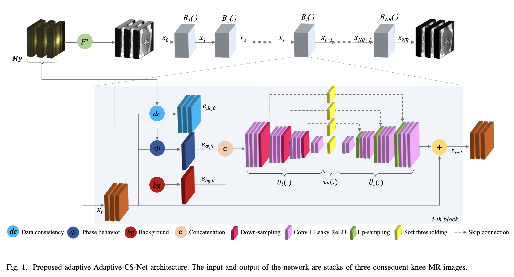
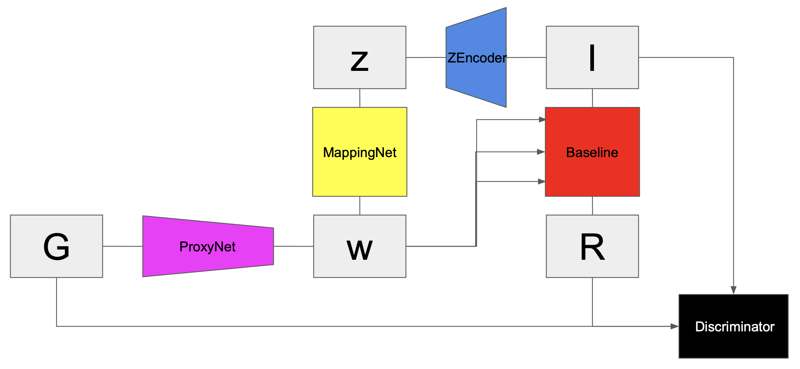
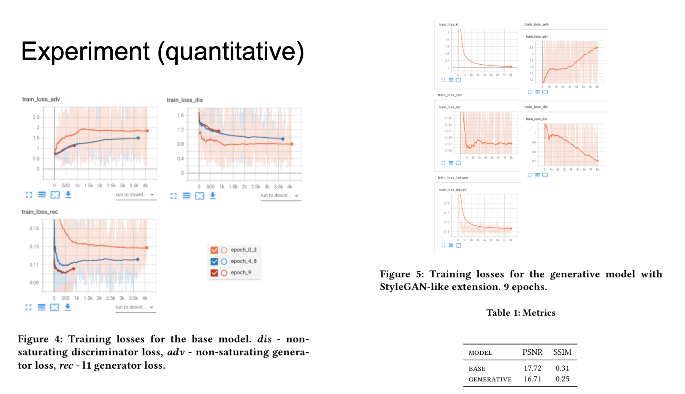
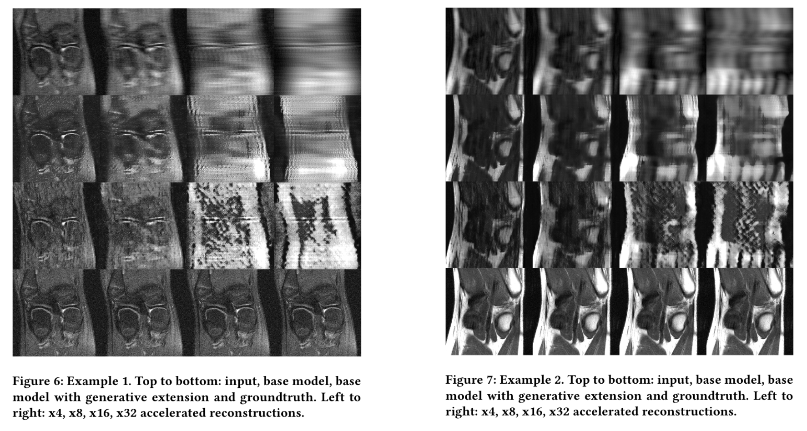

# Generating details for FastMRI on extremely sparse inputs

FastMRI - is a great challenge where one needs to reconstruct/augment the undersampled MRI scan (partially taken). Full scanning is quiet time-consuming (15 - 40 min) and a patient is obliged to stay still throughout the whole procedure.

To ease and fasten the process we can obtain only partial scan (x4, x8, x16, x32 acceleration rates could be achieved) and reconstruct it using Deep Learning.

In this work we tackle the hardest problem and propose the solution for the largest acceleration rates (i.e. extremely sparse input scans).

## Solution overview

1. Took the SOTA model [1] as a baseline
2. Designed and implemented generative extension to model texture vectors explicitly. Generative extension is highly inspired by [2].
3. Compare the baseline and the new generative model

There is also a prior work on this topic by prof. Dylov [3]. Our work is slightly parallel, as the approach to tackle the problem is quiet different, yet we highly encourage to read this paper as well for comprehensive understanding.

**Baseline architecture:**

**Generative architecture:**

For complete information about the project refer to the `report.pdf`.

## Prerequisites

* pytorch
* torchvision
* loguru
* pyyaml
* numpy
* matplotlib
* tqdm
* piq
* skimage

## Repository structure

There are specific entities that performs specific tasks:

* `main.py`: the entry to the pipeline, has bash interface (the main and only interface).
* `config`: configs for the base and generative models with all the hyperparameters included.
* `trainer`: convenient training wrappers used by `main.py`.
* `custom_nn`: implementations of all the modules. `base_model.py` - the baseline model. `model.py` - the generative model.
* `fastmri`: fastmri dataset related routines (transforms and dataset)

## Dataset

[FastMRI](https://fastmri.org) single-coil knee train and validation datasets were used for training and validation (PSNR and SSIM metrics calculation), correspondingly.

We used the same transformation as for UNet baseline model proposed by FastMRI creators except the normalization. Simple mapping to zero-one domain was employed.

In order to reproduce the results, one should download those datasets and put them into some directory. Path to this directory is then should be placed in the config: `dataset_path: './singlecoil'`.

## Training details and checkpoints

Training of both models was done for 9 epochs (around 24 hours per model with the other settings specified in the config) on Nvidia V100.

Baseline checkpoint: [link](https://drive.google.com/file/d/1-8TV80TnvurPB1hNe9rcg-zxXxp3B4V7/view?usp=sharing)

Generative checkpoint: [link](https://drive.google.com/file/d/1-pz0_AWCGmLtI1hrduU3TXq7ii-17-aD/view?usp=sharing)

## Resume of the results

* Sharper reconstruction comparing to the baseline. Though the details are quiet bad. The texture blobs are too big and almost don’t correspond to the ground truth.
* Generative model severely hallucinates even on low acceleration rates that lowers its metrics

**Training loss curves and metrics:**

**Reconstruction examples:**

## Analysis

* Better modelling of texture vectors is required (not the one global texture vector, but a set of texture vectors)
* Appliance of texture vectors is not spatially-adaptive (AdaIN)
* “Attention is all you need”
* Better proxy guidance (remove low-frequency information)

[1]: https://arxiv.org/pdf/2004.07339.pdf
[2]: https://arxiv.org/pdf/1812.04948.pdf
[3]: https://arxiv.org/pdf/2103.02940.pdf
